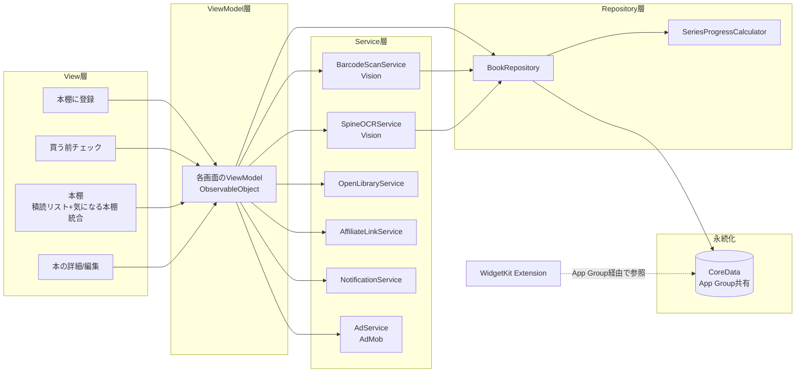
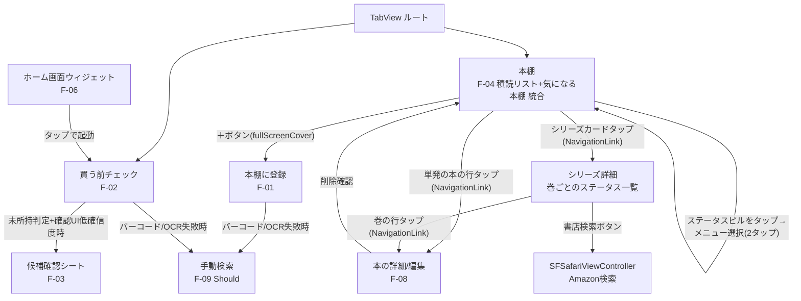
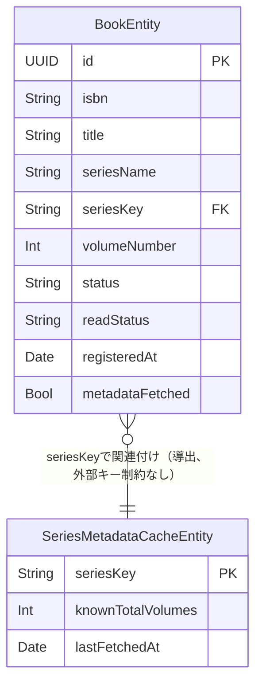
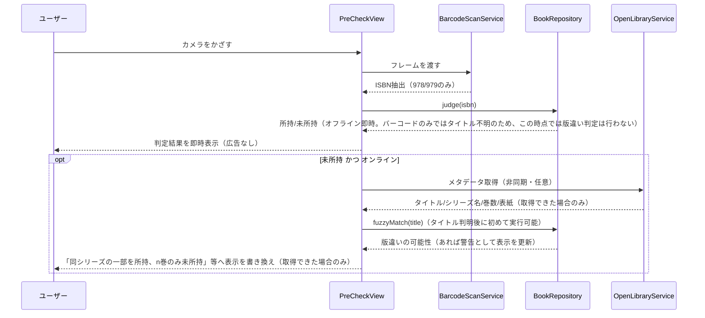
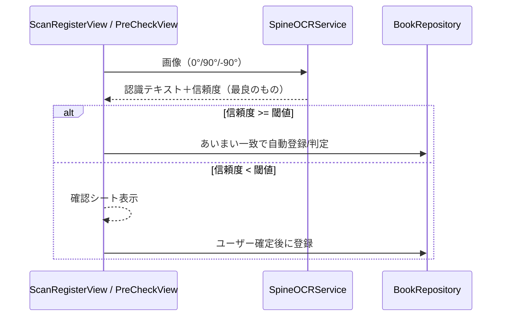

# 基本設計書「積読レーダー」

| 項目 | 内容 |
|---|---|
| 文書バージョン | v1.5（積読リスト・気になる本棚 統合版） |
| 作成日 | 2026-09-04 |
| 参照元 | [要件定義書](./要件定義書.md) v1.6 |
| 対象プラットフォーム | iOS（SwiftUI, iOS 17+目安・実装時のXcode最新版に準拠） |

---

## 1. アーキテクチャ方針

### 1.1 全体構成

MVVMを採用する。サーバーを持たないため、バックエンドはCoreData（端末内DB）とOpen Library / AdMob等の外部SDK・APIへの直接アクセスで構成する。



### 1.2 レイヤーの責務

| レイヤー | 責務 |
|---|---|
| View | SwiftUIによる画面表示。状態はViewModelに委譲し、ロジックを持たない |
| ViewModel | 画面ごとの状態管理とユーザー操作のハンドリング。Service/Repositoryを呼び出す |
| Service | Vision（バーコード/OCR）、Open Library API、AdMob、UserNotifications、アフィリエイトURL生成など外部・フレームワーク連携を担当 |
| Repository | CoreDataへのCRUD操作を一元化。ViewModelはCoreDataを直接触らない |
| Repository（派生） | `SeriesProgressCalculator` は `BookRepository` から取得した `Book` 一覧をもとに `SeriesProgress` を算出する（既刊総数不明時のフォールバックロジックを含む） |

### 1.3 ディレクトリ構成（案）

```
BookReader/
  App/
    BookReaderApp.swift
  Features/
    ScanRegister/          # F-01 本棚に登録
    PreCheck/               # F-02 買う前チェック
    Shelf/                   # F-04 本棚（積読リスト＋気になる本棚 統合）
    BookDetail/              # F-08 編集・削除
    ManualSearch/            # F-09 手動追加（Should）
  Core/
    Models/                  # Book, OwnershipStatus, ReadStatus, UnifiedStatus, SeriesProgress
    Persistence/
      BookReader.xcdatamodeld
      BookRepository.swift
      SeriesMetadataCache.swift
    Services/
      BarcodeScanService.swift
      SpineOCRService.swift
      OpenLibraryService.swift
      AffiliateLinkService.swift
      NotificationService.swift
      AdService.swift
  SharedUI/                  # 共通コンポーネント（バッジ、進捗バー等）
BookReaderWidget/             # WidgetKit Extension（F-06）
```

---

## 2. 画面遷移設計

### 2.1 画面構成

ルートは`TabView`とし、常設タブを2つ（買う前チェック／本棚）、モーダル/プッシュ遷移で残りの画面（＋Should機能1画面）を提供する（v1.6で「積読リスト」「気になる本棚」タブを「本棚」1つに統合）。



### 2.2 遷移の実装方針

- タブ間: `TabView(selection:)`。ウィジェットからの起動時はDeep Link（`URL Scheme`または`NSUserActivity`）で `selection` を`.preCheck`に固定してアプリを起動する。
- 「本棚に登録」: `fullScreenCover`で提示（カメラ全画面表示のため）。
- 「本の詳細」: `NavigationStack`の`NavigationLink`でプッシュ。
- 「候補確認シート」（F-03低確信度時）: `.sheet`で提示、確定操作まで登録しない。
- 書店検索: `SFSafariViewController`を`UIViewControllerRepresentable`でラップし`.sheet`または`.fullScreenCover`表示。

---

## 3. 画面設計

### 3.1 買う前チェック（F-02） `PreCheckView`

| 項目 | 内容 |
|---|---|
| ViewModel | `PreCheckViewModel` |
| 主要State | `scanState: .scanning / .judged(JudgeResult) / .error`、`isLoadingMetadata: Bool` |
| 表示要素 | カメラプレビュー（`AVCaptureVideoPreviewLayer`をラップ）、判定結果カード、「気になるリストへ」ボタン、「手動で探す」導線（バーコード認識に繰り返し失敗した場合に表示） |
| アクション | バーコード検出→`BarcodeScanService`→`BookRepository.judge(isbn:)`→所持/未所持を即時表示（オフライン）。未所持かつオンラインの場合、非同期でOpen Libraryからタイトルを取得できた**後に初めて**`SpineOCRService`のあいまい一致ロジックを流用したタイトル類似判定（`BookRepository.fuzzyMatch(title:)`）を実行し、版違い警告として表示を更新する（バーコードのみではタイトルが不明なため、この判定は即時には行えない。詳細は詳細設計書4.1a参照）。この警告はあくまで情報提示であり、ユーザーは警告を見た上でも「気になるリストへ」を通常どおりタップでき、その場合は新規ISBNの別レコードとして登録される（版の統合は行わない、要件定義書11章参照）。バーコードが認識できない場合は手動検索（F-09）へ遷移できる（要件定義書F-09参照） |
| 広告 | 表示しない（N-06） |

### 3.2 本棚に登録（F-01） `ScanRegisterView`

| 項目 | 内容 |
|---|---|
| ViewModel | `ScanRegisterViewModel` |
| 主要State | `detectedItems: [DetectedBookCandidate]`、`isRegistering: Bool` |
| 表示要素 | カメラプレビュー、検出数チップ、候補サムネイル一覧（ライブカメラのクロップ画像を即時表示、後からOpen Library公式表紙に置き換え。4.4参照）、「この◯冊を登録する」ボタン |
| アクション | 連続検出→重複チェック（`BookRepository.isDuplicate(isbn:title:)`）→一括`insert` |

### 3.3 本棚（F-04、積読リスト＋気になる本棚 統合） `ShelfView`

| 項目 | 内容 |
|---|---|
| ViewModel | `ShelfViewModel` |
| 主要State | `standaloneBooks: [Book]`（シリーズ未確定の単発本）、`seriesCards: [SeriesProgress]` |
| 表示要素 | 「本」セクション（単発本の行、統一ステータスピル、経過日数バッジ）、「シリーズ」セクション（完結率プログレスバー or 「不明」表示、巻ごとの統一ステータス内訳、タップでシリーズ詳細へ）、バナー広告（F-07） |
| アクション | ステータスピルをタップ→`StatusPillMenu`のメニューから選択（2タップ）→`ShelfViewModel.changeStatus(bookID:to:)`→`BookRepository.update(_:)`。シリーズカードタップ→`SeriesDetailView`へ遷移し巻ごとの個別ステータス変更・書店検索を行う |

### 3.4 シリーズ詳細（F-04内・巻ごとのステータス） `SeriesDetailView`

| 項目 | 内容 |
|---|---|
| 主要データ | `SeriesProgress.volumes: [SeriesVolumeEntry]`（巻数・統一ステータス） |
| 表示要素 | 完結率、次の巻を探すボタン、巻ごとの行（統一ステータスピル） |
| アクション | 書店検索ボタン→ISBN既知（F-02で明示的にスキャン済みの巻）なら`AffiliateLinkService.amazonSearchURL(isbn:)`、自動提案の未スキャン巻でISBN不明なら`amazonSearchURL(keywords:)`にフォールバック→SFSafariViewController（詳細設計書4.9参照）。巻の行タップで`BookDetailView`へ遷移し全項目編集も可能 |

### 3.5 本の詳細/編集（F-08） `BookDetailView`

| 項目 | 内容 |
|---|---|
| ViewModel | `BookDetailViewModel` |
| 主要State | `editableBook: Book`、`showDeleteConfirm: Bool` |
| 表示要素 | タイトル・シリーズ名・巻数・ステータスの編集フォーム、削除ボタン |
| アクション | 保存→`BookRepository.update(_:)`→`SeriesProgressCalculator`再計算をトリガー。所持ステータスや既読ステータスの変更は`update(_:)`内部で通知スケジュール/キャンセルも自動的に再評価される（5.6参照）。削除→確認ダイアログ→`BookRepository.delete(_:)` |

---

## 4. データベース設計（CoreData）

### 4.1 Entity定義

**BookEntity**

| 属性 | 型 | 説明 |
|---|---|---|
| id | UUID | 主キー |
| isbn | String? | nilはOCR登録分。インデックスを張り`買う前チェック`の即時照合を高速化 |
| title | String | バーコードのみで登録し未取得の間は仮タイトル `"ISBN: {isbn}"` を格納する（4.4参照） |
| seriesName | String? | OCR/API由来の表示用文字列（表記ゆれをそのまま保持） |
| seriesKey | String? | `seriesName`を正規化した内部キー。`SeriesMetadataCacheEntity`とのグルーピング・キャッシュ照合に使用する（4.3参照） |
| volumeNumber | Int32? | |
| coverImageURL | String? | Open Libraryキャッシュ |
| status | String（enum rawValue） | `owned` / `wishlist` |
| readStatus | String（enum rawValue） | `unread` / `reading` / `finished` |
| registeredAt | Date | |
| lastOpenedAt | Date? | |
| metadataFetched | Bool | Open Libraryからのタイトル・表紙取得が完了したか（4.4参照）。OCR登録分は初回登録時点でタイトルが確定しているため`true`とする |

**SeriesMetadataCacheEntity**（既刊総数のキャッシュ、F-05のフォールバック実装に対応）

| 属性 | 型 | 説明 |
|---|---|---|
| seriesKey | String | 主キー（`SeriesKeyNormalizer`による正規化済みキー、4.3参照） |
| knownTotalVolumes | Int32? | Open Libraryから取得できた場合のみ設定。nilなら「不明」としてフォールバック表示 |
| lastFetchedAt | Date | 再取得の要否判定に使用（例: 30日以上前なら再取得） |

### 4.2 ER概要



CoreDataのリレーションとしては定義せず、`seriesKey`文字列一致による論理的な関連付けとする（正規化コストよりMVPの実装速度を優先）。

### 4.3 シリーズ名の正規化とSeriesProgress算出ロジック

**シリーズ名の正規化（`SeriesKeyNormalizer`）**

OCRやOpen Libraryから取得する`seriesName`は表記ゆれ（全角/半角、空白、副題の有無、末尾の「(1)」等）が起きやすく、生の文字列をキャッシュキーに使うと同一シリーズが分裂して完結率が不正確になる。そのため、`seriesName`とは別に正規化済みの`seriesKey`を持たせ、キャッシュ照合・グルーピングには常に`seriesKey`を使う。

```
SeriesKeyNormalizer.normalize(_ raw: String) -> String
1. 全角英数・記号を半角に統一（NFKC正規化）
2. 前後の空白・全角スペースを除去
3. 巻数表記（例: "(1)"「 1」「第1巻」等の末尾パターン）を除去
4. 小文字化（英字混じりタイトル対策）
```

`SeriesProgressCalculator`はこの`seriesKey`単位でグルーピングする。なお、正規化だけでは同一視できない別表記（略称違いなど）が残るリスクは許容し、明らかな誤グルーピングはF-08の編集機能で`seriesName`を手動修正することで訂正可能とする。

**SeriesProgress算出ロジック（`SeriesProgressCalculator`）**

```
1. BookRepositoryから status = .owned または .wishlist の全Bookを取得
2. seriesKeyでグルーピングし、ownedVolumes = status=.owned の volumeNumber一覧
3. SeriesMetadataCacheEntity（seriesKeyで検索）を参照
   - knownTotalVolumes が存在する場合:
       missingVolumes = 1...knownTotalVolumes のうち ownedVolumes にない巻
       completionRate = ownedVolumes.count / knownTotalVolumes
       nextVolumeToBuy = missingVolumes.min()
   - knownTotalVolumes が nil の場合（F-05フォールバック）:
       missingVolumes = 不明（nilとして扱う）
       completionRate = 不明（UIでは進捗バーを表示せず「不明」と表示）
       nextVolumeToBuy = ownedVolumes.max() + 1 （暫定候補）
4. lastFetchedAtが30日以上前、またはレコードが存在しない場合、
   OpenLibraryServiceへ既刊総数の再取得を非同期でトリガー（判定結果の表示はブロックしない）
```

### 4.4 メタデータ未取得本のバックフィル設計

バーコードのみで登録した本は、登録時点でCoreDataに書き込める情報がISBNのみであり、`title`は非オプショナルのため以下のルールで暫定値を入れる。

```
登録時（F-01/F-02、オンライン）:
  Open Libraryへの問い合わせを試みる（タイムアウト5秒）
  成功 → title・coverImageURLを正しい値で保存、取得したタイトルからシリーズ名・巻数を分解して
         seriesName/volumeNumberも更新（詳細設計書4.3a TitleParser参照）、metadataFetched = true
  失敗/オフライン → title = "ISBN: {isbn}"、coverImageURL = nil、metadataFetched = false

アプリ起動時・フォアグラウンド復帰時（BookReaderApp の scenePhase 監視）:
  metadataFetched = false の Book を全件取得
  オンラインであれば OpenLibraryService へ再取得をバックグラウンドで一括リクエスト
  取得できたものから順に title・coverImageURL・metadataFetched を更新
```

「本棚に登録」（F-01）のサムネイル表示はこのバックフィルを待たない。ライブカメラで撮影したフレームから背表紙部分をクロップした画像を即時表示し、Open Libraryの公式表紙画像が後から取得できた時点で置き換える（オフラインでも一覧が空白にならないようにするため）。

---

## 5. 外部インターフェース設計

### 5.1 バーコード検出（`BarcodeScanService`）

- `VNDetectBarcodesRequest`の`symbologies`に`.ean13`のみを指定する。
- 検出結果の`payloadStringValue`が`^97[89]\d{10}$`（ISBN-13、978/979始まり）に一致しない場合は破棄する（価格JAN等の除外、要件定義書F-01/F-02対応）。
- `VNImageRequestHandler`はメインスレッドをブロックしないよう専用の`DispatchQueue`上で実行する。

### 5.2 背表紙OCR（`SpineOCRService`）

- `VNRecognizeTextRequest`の`recognitionLanguages = ["ja-JP", "en-US"]`、`recognitionLevel = .accurate`、`usesLanguageCorrection = true`を設定する。
- 和書の背表紙は縦書きが多く、Visionは横書き前提の認識精度が高いため、キャプチャ画像を**0度・90度・-90度の3方向に回転させて個別に認識処理を実行し、最も高い信頼度（`VNRecognizedText.confidence`）の結果を採用する**。
- 信頼度が閾値（暫定: 0.5）未満の場合は確認UI（`ConfirmCandidateSheet`）を表示し、自動登録しない。
- タイトルのあいまい一致には正規化（全角/半角統一、記号除去）後にLevenshtein距離ベースの類似度を用い、閾値（暫定: 0.8）以上を高確信度一致とみなす。このロジックはF-02の版違い警告でも共用する。

### 5.3 Open Library連携（`OpenLibraryService`）

| API | エンドポイント | 用途 |
|---|---|---|
| ISBN検索 | `GET https://openlibrary.org/api/books?bibkeys=ISBN:{isbn}&format=json&jscmd=data` | タイトル・表紙URL取得（F-02/F-01のメタデータ補完） |
| Works検索 | `GET https://openlibrary.org/search.json?q={title}` | 既刊総数の推定（取得不可の場合はF-05フォールバックへ） |

- タイムアウトは5秒とし、失敗時は例外を握りつぶしてキャッシュ済み表示にフォールバックする（判定ロジック自体は成立させる、N-02）。
- レスポンスは`SeriesMetadataCacheEntity` / `BookEntity.coverImageURL`にキャッシュし、以降はオフラインで再利用する。

### 5.4 アフィリエイトリンク生成（`AffiliateLinkService`）

```swift
func amazonSearchURL(isbn: String) -> URL {
    var components = URLComponents(string: "https://www.amazon.co.jp/s")!
    components.queryItems = [
        URLQueryItem(name: "k", value: isbn),
        URLQueryItem(name: "tag", value: "taros0480x84e-22")
    ]
    return components.url!
}
```

トラッキングIDはコード直書きで問題ない（公開が前提の値、要件定義書11章参照）。将来的にストアを追加する場合は`enum Storefront`で拡張できる形にしておく。

### 5.5 広告（`AdService` / AdMob）

- `GoogleMobileAds` SDKを導入し、バナー広告（本棚画面）とインタースティシャル広告（本棚一括登録完了時のみ）を実装する。
- アプリ起動時、`ATTrackingManager.requestTrackingAuthorization`をユーザーに提示した**後**にAdMobの初期化・広告リクエストを行う（N-09）。拒否時は非パーソナライズ広告（`npa=1`相当）にフォールバックする設定をAdMob側で行う。
- 判定結果画面（`PreCheckView`の判定後表示）には広告コンポーネントを一切配置しない（N-06）。

### 5.6 通知（`NotificationService`）

- `UNUserNotificationCenter`にローカル通知を登録する。
- トリガーは`registeredAt + 30日`の絶対日時（`UNCalendarNotificationTrigger`）。identifierは`Book.id.uuidString`。
- スケジュール/キャンセルの判断はViewModel側に持たせず、**`BookRepository`の書き込みメソッド内で一元的に判定・実行する**（画面ごとに呼び忘れるリスクを避けるため）。具体的な遷移ルールは以下の通り。

| 操作 | status | readStatus | 通知の扱い |
|---|---|---|---|
| 新規登録（F-01/F-03/F-09） | `.owned` | `.unread` | スケジュール |
| 新規登録 | `.wishlist` | - | スケジュールしない |
| `update()`で`.wishlist → .owned`かつ`readStatus = .unread` | - | - | 新規スケジュール（未所持登録時は通知していないため） |
| `update()`で`readStatus`が`.finished`になる | - | - | 既存通知をキャンセル |
| `update()`で`.owned → .wishlist`になる | - | - | 既存通知をキャンセル |
| `delete()` | - | - | 既存通知をキャンセル |

### 5.7 WidgetKit（F-06）

- App Groupを設定（識別子: `group.<bundle-id>.bookreader`）し、メインアプリ・Widget Extension双方からアクセス可能なApp GroupコンテナにCoreDataストア（`NSPersistentContainer`の`url(forStoreName:)`をApp Groupコンテナに向ける）を配置する。
- **マルチプロセス間の整合性**: アプリ本体とWidget Extensionは別プロセスとして同じSQLiteストアを開くため、`NSPersistentStoreDescription`に`setOption(true as NSNumber, forKey: NSPersistentHistoryTrackingKey)`と`NSPersistentStoreRemoteChangeNotificationPostOptionKey`を設定し、他プロセスの変更をPersistent History経由で検知できるようにする。両プロセスの`viewContext.automaticallyMergesChangesFromParent`は`true`に設定する。
- Widgetは`TimelineProvider`で積読本の件数・最長経過日数を1日1回程度の定期更新に加え、**アプリ側で本の登録・編集・削除・読了操作が発生した直後に`BookRepository`から`WidgetCenter.shared.reloadTimelines(ofKind:)`を呼び出し、即時に最新状態を反映する**（定期更新だけに頼らない）。
- ウィジェットタップ時は`widgetURL(_:)`でDeep Link（例: `bookreader://precheck`）を発行し、アプリ側で`onOpenURL`により買う前チェックタブへ遷移する。

---

## 6. 処理方式設計（主要シーケンス）

### 6.1 買う前チェック（F-02）



> **v1.2からの修正**: 当初の図は`fuzzyMatch(title)`を`judge(isbn)`の直後（同期・オフライン）に実行するよう描いていたが、バーコードから得られるのはISBNのみでタイトルを含まないため、この時点でタイトル一致判定は実行不可能だった。詳細設計書4.1a・5.1のレビューで判明し、非同期メタデータ取得の後段に移した（詳細設計書v1.0参照）。

### 6.2 背表紙OCRフォールバック（F-03）



---

## 7. 非機能要件の設計反映

| 要件ID | 設計上の対応 |
|---|---|
| N-01（即時性） | バーコード判定はCoreDataのインデックス済み`isbn`属性への`NSPredicate`検索のみで完結させ、ネットワーク呼び出しを介在させない |
| N-02（オフライン） | `OpenLibraryService`呼び出しは全て`Task`＋タイムアウト付きで判定フローと分離し、失敗を握りつぶす |
| N-03（プライバシー） | `VNImageRequestHandler`に渡す画像はメモリ上のみで処理し、ディスクへの保存は行わない |
| N-04（対応OS） | 実装時に確定するため本設計書では固定値を持たない。Xcodeプロジェクトの`Deployment Target`設定のみで管理する |
| N-05（UI/UX） | 判定結果カード・シリーズカードの文言/配色は「持っていません」を断定的な否定表現にせず、`ShelfView`・`PreCheckView`のコンポーネントで肯定的な次アクション（気になるリストへ／書店検索へ）を常にセットで提示する |
| N-06（広告体験） | `PreCheckView`（3.1）の判定結果画面には広告コンポーネントを配置しない設計とし、`AdService`の呼び出し自体をこの画面のView階層から除外する。本棚画面（`ShelfView`）は購入導線と広告を併存させる方針（v1.6でF-04/F-05統合に伴い変更） |
| N-07（重複防止） | `BookRepository.isDuplicate(isbn:title:)`を登録経路（F-01/F-03/F-09）すべてで共通利用する |
| N-08（アクセシビリティ） | SharedUIコンポーネントは固定フォントサイズを避け、`.dynamicTypeSize`に追従させる。詳細な文言・レイアウト調整は詳細設計/実装時に行う |
| N-09（ATT） | `AdService`の初期化をATT許諾フローの後段に置く |

---

## 8. エラーハンドリング方針

| 状況 | 方針 |
|---|---|
| カメラ権限拒否 | 権限説明＋設定アプリへの導線を表示し、機能自体は無効化する |
| Open Library APIタイムアウト/エラー | 無視してローカルデータのみで表示継続（判定結果に影響させない） |
| CoreData保存失敗 | ユーザーにアラート表示し、再試行を促す（原則発生しない想定だが握りつぶさない） |
| OCR認識結果が空 | 手動検索（F-09）または直接入力への導線を提示する |

---

## 9. 未確定事項・実装時に決定する項目

- OCR信頼度・あいまい一致の具体的な閾値（0.5 / 0.8は暫定値、実機テストで調整）
- 対応最小iOSバージョン（要件定義書N-04の通り実装時に確定）
- AdMobの広告ユニットID（本番用は審査・登録後に発行）
- 積読リマインド通知の具体的な文言・WidgetKitのレイアウト詳細

